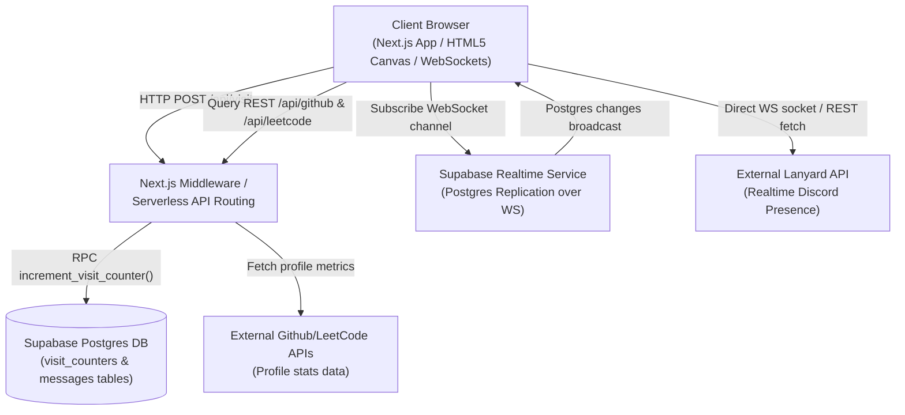
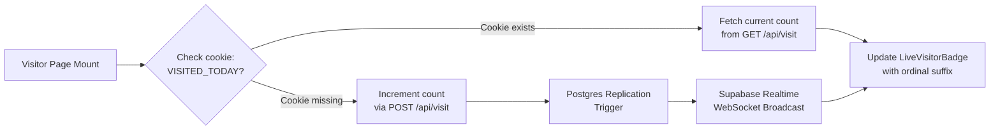
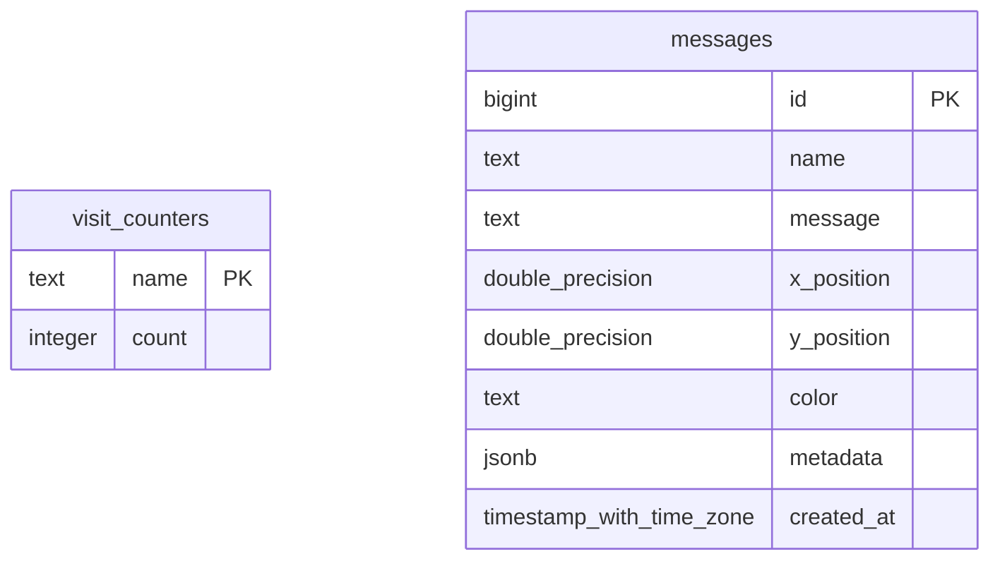

# Interactive OS-Style Portfolio

A desktop-style portfolio website built with Next.js, React, TypeScript, Tailwind CSS, Framer Motion, and Supabase. The application features draggable and resizable windows, a real-time guestbook constellation, page visit tracking, and keyboard-driven command navigation.

<p align="center">
  
  
  
  
  
  
</p>

<p align="center">
  <strong>
    <a href="https://luv-patel.vercel.app">Live Demo</a>
    &nbsp;&bull;&nbsp;
    <a href="PROJECT_DEEP_DIVE.md">Developer Deep Dive</a>
  </strong>
</p>

---

## Key Features

*   **Desktop Window Manager:** Draggable and resizable panels with z-index layer management, collision detection at viewport boundaries, and window states persistent in `localStorage`.
*   **Command Bar (Ctrl+K or /):** Keyboard-driven navigation interface with fuzzy-search matching to open/close panels and reset layouts.
*   **Interactive Guestbook Constellation:** Renders visitor message nodes on an HTML5 canvas. Connects messages dynamically based on spatial distance and uses WebGL parameters with a 32-bit FNV-1a hash to generate unique visitor fingerprints to prevent message spam.
*   **Real-time Visitor Counter:** Live visitor counter with ordinal formatting synchronized across clients via Supabase WebSocket replication logs and updated atomically using Postgres RPC functions.
*   **Discord & Spotify Integration:** Live status updates and active Spotify playback tracking using the Lanyard API over WebSockets.
*   **Widgets:** Speed typing tester, combined GitHub and LeetCode activity heatmap, and collapsible experience timeline.
*   **View Transitions:** Theme toggling (light/dark) using the browser View Transitions API and CSS clip-paths for circular reveal effects.

---

## System Architecture & Data Flow

The system uses a hybrid synchronization design. Static assets and profile stats use cached server routes, while visitor updates and guestbook messages sync asynchronously over WebSockets.

### 1. System Architecture



### 2. Page Visit Counter Data Lifecycle

To enforce strong transactional consistency and prevent race conditions, counter increments bypass direct client writes and are routed through serverless routines calling database RPC functions:



---

## Engineering Challenges & Solutions

### 1. Pointer Tracking on Scaled Containers
*   **Problem:** Dragging or resizing absolute-positioned panels within a scaled CSS container (`transform: scale(...)`) causes the panel position to drift away from the cursor. Browser pointer offsets report physical viewport coordinates, which do not scale with the container.
*   **Solution:** Recalculated drag deltas by tracking the container scale factor via `ResizeObserver` and adjusting mouse movement offset before writing values back to state:
    $$\Delta X_{\text{adjusted}} = \frac{e.\text{clientX} - \text{dragStart}.x}{\text{canvasScale}}$$
    This maintains accurate coordinate mapping under any scale level.

### 2. Client-Side Telemetry & Spam Prevention
*   **Problem:** Enabling public positioning of messages on a shared HTML5 canvas can lead to spam without user authentication.
*   **Solution:** Built a lightweight browser fingerprinting pipeline. On submission, the client queries screen parameters, hardware details (device memory, CPU cores), and WebGL GPU details (from `WEBGL_debug_renderer_info`). These parameters are hashed using a 32-bit FNV-1a algorithm to generate a stable, non-identifying fingerprint. This fingerprint prevents duplicate entries without requiring login.

### 3. Hydration Mismatch for Viewport-Bound Positions
*   **Problem:** Next.js pre-renders HTML on the server. Because viewport dimensions (`window.innerWidth`, `window.innerHeight`) are unavailable on the server, generating default panel coordinates before rendering caused hydration mismatches.
*   **Solution:** Initialized empty layout states during server rendering, and deferred calculating default coordinates to a client-side `useEffect` hook executing post-hydration:
    ```typescript
    const [panels, setPanels] = useState<Record<PanelType, PanelState>>({} as Record<PanelType, PanelState>);
    const [isInitialized, setIsInitialized] = useState(false);

    useEffect(() => {
        if (isInitialized) return;
        setPanels(createDefaultPanelState(window.innerWidth, window.innerHeight, dims));
        setIsInitialized(true);
    }, [isInitialized]);
    ```

---

## Tech Stack & Schema Design

### 1. Stack Breakdown
*   **Next.js 16 (App Router):** Static site generation, server-side caching, and API routing.
*   **Supabase (PostgreSQL):** PostgreSQL database engine with realtime WebSocket replication.
*   **Framer Motion:** Physics-based drag and resize interactions.
*   **Tailwind CSS & Radix UI:** Utility styling and accessible component primitives.
*   **cmdk:** Keyboard fuzzy search navigation.
*   **Lanyard API:** External WebSocket integration for live status.

### 2. Database Schema ER Diagram



---

## Getting Started

### Prerequisites
*   Node.js 18+ and npm / yarn / pnpm
*   An active Supabase PostgreSQL database project
*   Git

### Installation & Run

1.  **Clone the project:**
    ```bash
    git clone https://github.com/luvp21/Portfolio.git
    cd Portfolio
    ```

2.  **Install dependencies:**
    ```bash
    npm install
    ```

3.  **Setup Environment Variables:**
    Create a `.env.local` file in the root directory:
    ```env
    NEXT_PUBLIC_SUPABASE_URL=your_supabase_project_url
    NEXT_PUBLIC_SUPABASE_ANON_KEY=your_supabase_anon_key
    SUPABASE_SERVICE_ROLE_KEY=your_supabase_service_role_key
    ```

4.  **Supabase Setup (SQL Editor):**
    Execute the following script to create tables, set up Row Level Security (RLS) policies, and deploy the atomic RPC visit counter:
    ```sql
    -- Create visitor tracking table
    CREATE TABLE visit_counters (
        name text PRIMARY KEY,
        count integer DEFAULT 0
    );

    -- Create messages table for constellation guestbook
    CREATE TABLE messages (
        id bigint GENERATED BY DEFAULT AS IDENTITY PRIMARY KEY,
        name text NOT NULL,
        message text NOT NULL,
        x_position double precision NOT NULL,
        y_position double precision NOT NULL,
        color text DEFAULT '#ffffff',
        metadata jsonb,
        created_at timestamp with time zone DEFAULT timezone('utc'::text, now()) NOT NULL
    );

    -- Enable Row Level Security (RLS)
    ALTER TABLE visit_counters ENABLE ROW LEVEL SECURITY;
    ALTER TABLE messages ENABLE ROW LEVEL SECURITY;

    -- Setup public read/write policies
    CREATE POLICY "Allow public read counters" ON visit_counters FOR SELECT USING (true);
    CREATE POLICY "Allow public read messages" ON messages FOR SELECT USING (true);
    CREATE POLICY "Allow public write messages" ON messages FOR INSERT WITH CHECK (true);

    -- Create atomic increment function
    CREATE OR REPLACE FUNCTION increment_visit_counter(p_name text)
    RETURNS integer AS $$
    DECLARE
      new_count integer;
    BEGIN
      INSERT INTO visit_counters (name, count)
      VALUES (p_name, 1)
      ON CONFLICT (name) DO UPDATE
      SET count = visit_counters.count + 1
      RETURNING count INTO new_count;
      RETURN new_count;
    END;
    $$ LANGUAGE plpgsql SECURITY DEFINER;
    ```
    *Note: Enable Supabase Realtime replication on the `visit_counters` and `messages` tables via the Supabase Dashboard.*

5.  **Launch the development server:**
    ```bash
    npm run dev
    ```
    Open [http://localhost:3000](http://localhost:3000) to view the canvas locally.

---

## Production Roadmap

*   **P0 (Security & Stability):**
    - [ ] Add recaptchas to guestbook forms to prevent automated script spam.
    - [ ] Guard serverless routes with strict CORS headers restricting queries to the portfolio domain.
    - [ ] Inject rate-limiting token bucket middleware on the API routes.
*   **P1 (Traffic Growth):**
    - [ ] Integrate a Redis cache layer (e.g. Upstash Redis) to buffer visit increments, periodically writing to PostgreSQL to save connection pool limits.
    - [ ] Set up database read replicas to offload guestbook historical queries.
*   **P2 (Observability & Optimization):**
    - [ ] Integrate Prometheus metrics and OpenTelemetry monitoring to trace API latencies.
    - [ ] Set up spatial index clustering on message coordinate vectors.

---

## Resume Bullet Points & Technical Keywords

### Resume Bullet Points
*   Built a desktop-style window manager in Next.js, TypeScript, and Tailwind CSS, managing boundary collisions and state persistence across page refreshes.
*   Designed a real-time guestbook utilizing Supabase WebSockets to synchronize and render message locations on an HTML5 canvas.
*   Implemented client WebGL context querying and FNV-1a hashing to generate browser fingerprints, preventing coordinate-based message spam.
*   Developed Next.js route handlers that interact with PostgreSQL RPC functions to update page counts atomically.
*   Corrected pointer dragging vectors on scaled CSS containers by adjusting viewport offsets based on container scale ratios.

### Technical Keywords
Next.js, React, TypeScript, Tailwind CSS, Framer Motion, Supabase, PostgreSQL, WebSockets, HTML5 Canvas, View Transitions API, RPC, ACID Transactions, Browser Fingerprinting, WebGL, Telemetry, ResizeObserver, REST API, Rate Limiting, OpenTelemetry, Redis caching.

---

## Screenshots

<table width="100%">
  <tr>
    <td width="50%"><br/><center><em>Draggable Panel Workspace</em></center></td>
    <td width="50%"><br/><center><em>Fuzzy Command Palette</em></center></td>
  </tr>
  <tr>
    <td width="50%"><br/><center><em>Constellation Guestbook</em></center></td>
    <td width="50%"><br/><center><em>Speed Typing Tester</em></center></td>
  </tr>
</table>

---

## License

This project is licensed under the MIT License - see the [LICENSE](LICENSE) file for details.

---

*Built with Next.js, Tailwind CSS, and Supabase.*
